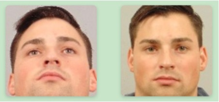
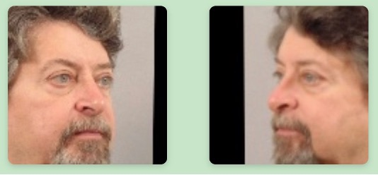
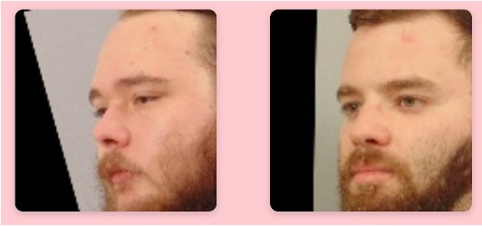
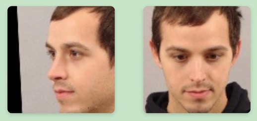

# Explanation of Genuine Pair with No Additional Information (Prompt 1)


---

## Input
**System Prompt:** [System Prompt A — Natural Language Style](PROMPTS.md#system-prompt-a) + 
```
Compare the following two face images and generate a detailed explanation of their similarities
and differences following the required format. Now provide the comparison focusing on the
similarities and differences across all key facial attributes. You must explain in terms of
the visual features following the given format. Do not say you can not. Just do it based on
what you see.

Image 1: [see left image below]
Image 2: [see right image below]
```



---

## Output

<pre>
<strong>Match Verdict:</strong> Match

<strong>Similarity Attributes:</strong>
Facial Structure has a broad, rounded shape with similar jaw and cheekbone width. Similar eye size, shape, and spacing. Comparable width and nasal tip. Same lip thickness and mouth shape. Dark, thick, and similarly arched eyebrows. Similar Proportions appear well-aligned. Consistent light skin tone and texture. Eye region contours and spacing are alike. Ears are not clearly visible. Similar forehead height and straight hairline.

<strong>Distinctive Differences:</strong>
Pose variation: left image has a strong upward tilt. Lighting differs slightly. Subtle change in expression.

<strong>Overall Reasoning:</strong>
Despite differences in angle and lighting, identity-relevant features strongly align, supporting the likelihood that both images are of the same person.
</pre>

---
---

# Explanation of Genuine Pair with Multi-Model Scores (Prompt iii-a)

**System Prompt:** [System Prompt A — Natural Language Style](PROMPTS.md#system-prompt-a) + [Prompt iii-a — Score-only, Multi-model](PROMPTS.md#prompt-iii-a)

---

## Input

**System Prompt:** [System Prompt A — Natural Language Style](PROMPTS.md#system-prompt-a) +
```
Compare the following two face images and generate a detailed explanation of their similarities
and differences following the required format. The scores of the various face recognition models
in a scale of [0, 1] for this pair are also provided for your reference. Now provide the
comparison focusing on the similarities and differences across all key facial attributes.
You must explain in terms of the visual features rather than the scores provided.

Image 1: [see left image below]
Image 2: [see right image below]

[Model Scores]
{ ... }   ← scores to be added
```



---

## Output

<pre>
<strong>Match Verdict:</strong> Match

<strong>Similarities:</strong>
Both images depict a person with similar facial features, including a consistent facial structure and the same eye configuration. The nose morphology appears to be similar, with a similar shape and size. The mouth and lips are comparable in form and positioning. The eyebrows have a consistent shape and thickness, and the hairline is similar, indicating the same individual. Skin tone and texture appear uniform across both images, and the periocular region shows consistent details, supporting a match.

<strong>Differences:</strong>
The primary difference between the two images is the angle of the face. Image 1 shows a frontal view, while Image 2 is a side profile. This affects the perception of facial symmetry and certain features like the ears, which are more visible in Image 2. Lighting conditions also slightly differ, but they do not obscure key facial attributes.

<strong>Overall Reasoning:</strong>
The consistent features across both images, despite the differences in angle and lighting, strongly suggest that these are images of the same person. The stable attributes, such as facial structure, eye configuration, and hairline, align well enough to support a match.
</pre>

---
---

# Explanation of Impostor Pair with Multi-Model Scores and Decisions (Prompt iv)

**System Prompt:** [System Prompt A — Natural Language Style](PROMPTS.md#system-prompt-a) + [Prompt iv — Score+Decision, Multi-model](PROMPTS.md#prompt-iv)

---

## Input

**System Prompt:** [System Prompt A — Natural Language Style](PROMPTS.md#system-prompt-a) +
```
Compare the following two face images and generate a detailed explanation of their similarities
and differences following the required format. The scores of the various face recognition models
and their decision for the given pair are also provided for your reference. Now provide the
comparison focusing on the similarities and differences across all key facial attributes.
You must explain in terms of the visual features rather than the scores provided.

Image 1: [see left image below]
Image 2: [see right image below]

[Model Scores]
{ ... }   ← scores to be added
```



---

## Output

<pre>
<strong>Match Verdict:</strong> Non-Match

<strong>Similarities:</strong>
Both images depict individuals with similar facial hair styles, featuring beards that cover the chin and extend along the jawline. The overall skin tone appears similar, with a fair complexion. Both subjects have a comparable hairstyle with hair receding slightly from the forehead. The eyes in both images are of a similar size and shape, contributing to a common facial configuration.

<strong>Differences:</strong>
The most noticeable difference lies in the facial structure; Image 1 shows a fuller face compared to the more defined structure in Image 2. The nose in Image 1 appears broader, while in Image 2, it is sharper and more pronounced. Additionally, the eyebrow thickness and shape differ, with Image 1 having thicker and more prominent eyebrows. There is also a difference in the expression and angle of the face, as Image 1 is slightly tilted, whereas Image 2 shows a more straightforward alignment. Lighting conditions create varying shadows, which affect the perception of features like the jawline and chin.

<strong>Overall Reasoning:</strong>
The combination of differences in facial structure, nose shape, eyebrow characteristics, and facial alignment outweigh the similarities in hair and skin tone. These distinct features support the verdict of a non-match, aligning with the face recognition model scores provided.
</pre>

---
---

# Explanations Across All Prompt Styles — Same Genuine Pair (pair\_00349)

The following example demonstrates how the **same genuine pair** is explained under three different prompting strategies. The image used is the same throughout (Figure 4). The **Ground Truth** for this pair is **Match**.



---

## Prompt Style i — No Additional Information

**System Prompt:** [System Prompt A — Natural Language Style](PROMPTS.md#system-prompt-a) + User prompt with no model scores

<pre>
<strong>Match Verdict:</strong> Match

<strong>Similarities:</strong>
Both images depict a person with similar facial structures, including a consistent jawline and chin shape. The nose morphology appears alike, with a similar bridge and tip. The periocular region, including the eye shape and spacing, is comparable in both images. The eyebrows have a similar thickness and arch. Skin tone and texture are consistent, suggesting similar ethnicity and age. The hairline and hair color are also notably similar, reinforcing the resemblance.

<strong>Differences:</strong>
The primary differences arise from the angles and expressions in each image. Image 1 is a side profile, highlighting the nose and jawline, while Image 2 is a downward-facing angle, which emphasizes the forehead and hairline. The expressions are neutral in both images, but the angles create slight variations in perceived facial symmetry. Lighting conditions are similar, providing a consistent view of skin texture and tone.

<strong>Overall Reasoning:</strong>
The similarities in facial structure, features, and skin attributes, combined with the consistent contextual factors, strongly indicate that the images are of the same person. The differences observed are primarily due to the angles and do not affect the overall match verdict.
</pre>

---

## Prompt Style iii-a — With Multi-Model Scores (No Decision)

**System Prompt:** [System Prompt A — Natural Language Style](PROMPTS.md#system-prompt-a) + [Prompt iii-a — Score-only, Multi-model](PROMPTS.md#prompt-iii-a)

<pre>
<strong>Match Verdict:</strong> Uncertain

<strong>Similarities:</strong>
Both images depict individuals with similar hairstyles and hair color, suggesting a potential match in these features. The facial structure appears comparable, with similar jawline contours. Additionally, the skin tone and texture seem consistent across both images, indicating a likeness in complexion.

<strong>Differences:</strong>
The primary differences arise in the angles and expressions. Image 1 shows a profile view, while Image 2 presents a front-facing perspective, making it challenging to compare certain features like the nose's full shape and ear contours. The expression in Image 2 may slightly alter the perception of facial features such as the mouth and eyebrows, which are less discernible in Image 1.

<strong>Overall Reasoning:</strong>
The similarities in stable features such as hair and general facial structure suggest a possible match. However, the differences in angle and expression, compounded by the profile versus frontal view, introduce uncertainty. The verdict leans towards uncertain due to these contextual variances.
</pre>

---

## Prompt Style iv — With Multi-Model Scores and Decisions

**System Prompt:** [System Prompt A — Natural Language Style](PROMPTS.md#system-prompt-a) + [Prompt iv — Score+Decision, Multi-model](PROMPTS.md#prompt-iv)

<pre>
<strong>Match Verdict:</strong> Match

<strong>Similarities:</strong>
The two images present several similar facial features, suggesting a likely match. The facial structure, particularly the jawline and chin, appears consistently shaped in both images. Eye configuration, including the distance between the eyes and the shape of the eyelids, is notably similar. The nose morphology, in terms of size and shape, shows a high degree of resemblance. Both images also share similar mouth and lip shapes, with comparable fullness and curvature. The hairline and hairstyle appear almost identical, contributing to the overall likeness. Skin tone and texture are consistent across both images, with no significant visible discrepancies.

<strong>Differences:</strong>
Despite the similarities, there are minor contextual differences that can be noted. The primary difference arises from the angle and pose: the first image is a profile view, while the second image is a frontal view with a slight downward tilt of the head. This change in angle affects the perception of facial symmetry and may slightly alter the appearance of facial features such as the nose and jawline. Lighting conditions also differ slightly, which may affect the perception of skin texture and tone. Additionally, the expression varies subtly, with the first image having a neutral expression and the second showing a slight pursing of the lips.

<strong>Overall Reasoning:</strong>
The strong similarities in stable facial attributes such as structure, eye configuration, and nose morphology support the decision of a match. While there are minor differences due to pose and lighting, these are contextual and do not significantly impact the overall facial recognition. The comprehensive agreement among most models further corroborates this conclusion.
</pre>

---

> **Observation:** For this genuine pair (Ground Truth: **Match**), Prompt Style i and iv correctly yield **Match**, while Prompt Style iii-a (scores only, no decisions) yields **Uncertain** — illustrating how including model decisions alongside scores can anchor the MLLM's verdict toward the correct outcome.
