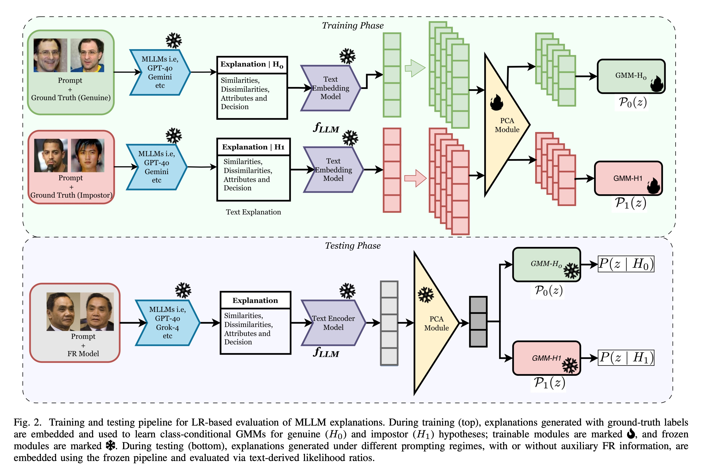
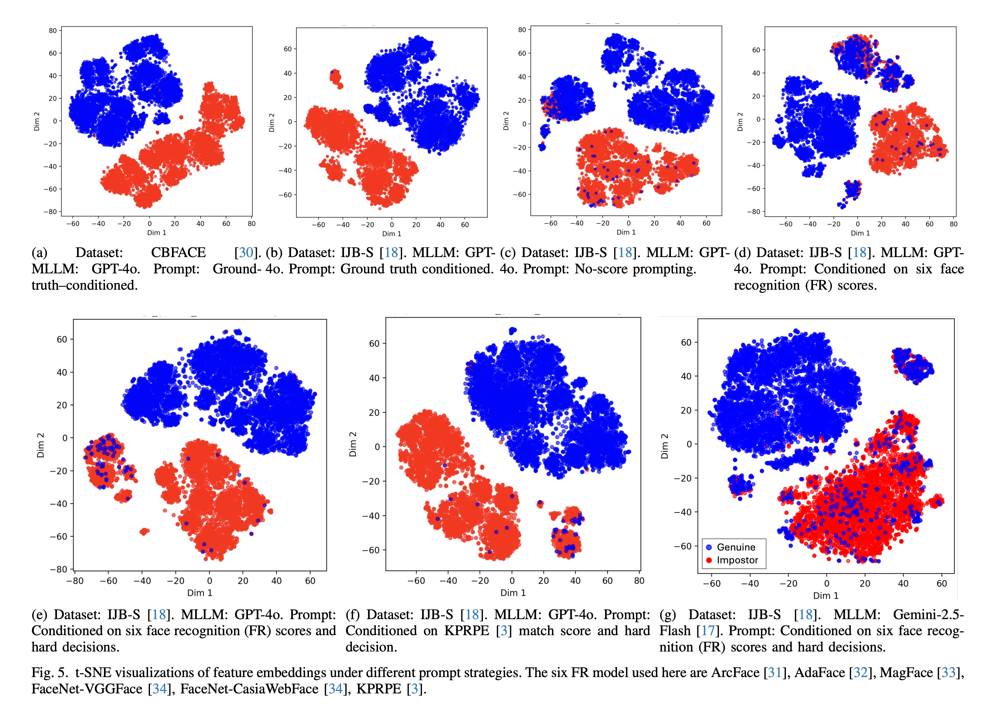
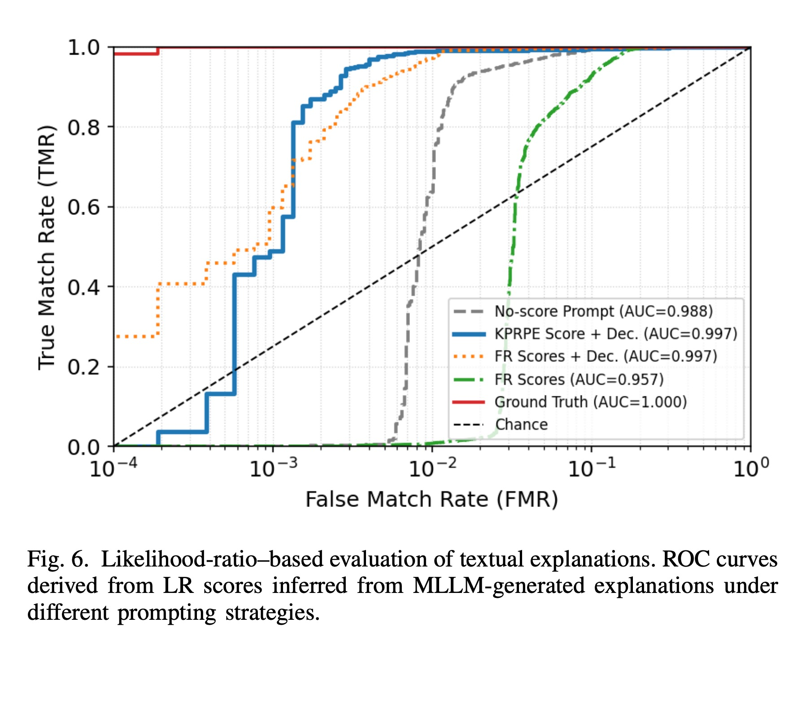

# MLLM-based Textual Explanations for Face Comparison

This repository contains the code and prompt templates for the paper **"MLLM-based Textual Explanations for Face Comparison"** accepted at IWBF 2026.

**Authors:** Redwan Sony, Anil K. Jain, Arun Ross

[](https://arxiv.org/abs/2603.16629)

## Overview

We systematically analyze MLLM-generated explanations for unconstrained face verification, with a focus on extreme pose variation and surveillance imagery. We introduce a likelihood-ratio (LR) based framework to evaluate the evidential strength of textual explanations beyond categorical accuracy.

### LR Framework Architecture



*Fig. 2 — Training and testing pipeline for LR-based evaluation of MLLM explanations. During training (top), explanations generated with ground-truth labels are embedded and used to learn class-conditional GMMs for genuine (H₀) and impostor (H₁) hypotheses. During testing (bottom), explanations generated under different prompting regimes are embedded using the frozen pipeline and evaluated via text-derived likelihood ratios.*

## Pipeline

```
Face Image Pairs
      │
      ▼
[1] Explanation Generation       ← Notebook_OpenAi.py / Notebook_Gemini.py / Notebook_Claude.py
      │  (textual .txt per pair)
      ▼
[2] Embedding                    ← Notebook_Embedding.ipynb
      │  (JSONL embeddings per experiment)
      ├──────────────────────────────────────────┐
      ▼                                          ▼
[3] Cluster Separability         [4] LR Model Training & Evaluation
    ClusterSeparability.py           lr_model/train_only.py
      │                                          │
      └──────────────────────────────────────────┘
                                   ▼
                          [5] Result Analysis
                              ResultsAnalysis.ipynb
```

## Repository Structure

```
.
├── Notebook_OpenAi.py             # Explanation generation via GPT models
├── Notebook_Gemini.py             # Explanation generation via Gemini models
├── Notebook_Claude.py             # Explanation generation via Claude models
├── PROMPTS.md                     # All system and user prompt templates (multi-level prompting strategy)
├── Notebook_Embedding.ipynb       # Embed textual explanations into vectors
├── ClusterSeparability.py         # Cluster separability analysis on embeddings
├── ResultsAnalysis.ipynb          # Final result analysis and reporting
├── run_openai_sequential.py       # Shared utilities (image loading, prompt building)
└── lr_model/
    ├── train_only.py              # GMM-based LR model training and evaluation
    ├── gmms.py                    # GMM fitting utilities
    └── utils/
        └── eval_utils.py          # Evaluation and plotting utilities
```

## Step-by-Step Usage

### Step 1 — Generate Explanations

Each notebook script queries a different MLLM provider with face image pairs and saves per-pair textual explanations as `.txt` files. We adopt a multi-level prompting strategy with four prompt variants providing progressively increasing FR information. Full prompt templates and descriptions are documented in [PROMPTS.md](PROMPTS.md).

**OpenAI (GPT-4o / GPT-5.2)**
```bash
python Notebook_OpenAi.py --start_idx 0 --end_idx 1000
```

**Google Gemini**
```bash
python Notebook_Gemini.py --start_idx 0 --end_idx 1000
```

**Anthropic Claude**
```bash
python Notebook_Claude.py \
    --model_name claude-opus-4-6 \
    --experiment_name with-kprpe-score-decision \
    --dataset_name IJBS \
    --start_idx 0 \
    --end_idx 1000 \
    --retry_limit 5
```

**Arguments (Claude / Gemini / OpenAI):**

| Argument | Description | Default |
|---|---|---|
| `--start_idx` | Start index of pairs to process | `0` |
| `--end_idx` | End index of pairs to process | `100000` |
| `--model_name` | MLLM model name | `claude-opus-4-6` |
| `--experiment_name` | Experiment variant (controls prompt/output dir) | `with-kprpe-score-decision` |
| `--dataset_name` | Dataset to use (`IJBS`, `BUPT-CBFace`) | `IJBS` |
| `--retry_limit` | API call retry limit | `5` |

Outputs are saved under `.data/<DATASET>/Explanations-<experiment_name>/<model_name>/`.

---

### Step 2 — Embed Explanations

Open and run `Notebook_Embedding.ipynb`. It reads the `.txt` explanation files produced in Step 1, encodes them using an embedding model (e.g. `text-embedding-3-small`), and writes a `.jsonl` file where each line contains:

```json
{"pair_id": "...", "embedding": [...]}
```

Output: `.data/<DATASET>/Explanations-<experiment_name>/<gen_model>_<embed_model>_embeddings.jsonl`

---

### Step 3 — Cluster Separability Analysis

`ClusterSeparability.py` loads the JSONL embeddings, assigns genuine/impostor labels from the metadata CSV, and computes five cluster separability metrics on the original embedding space:

| Metric | Description |
|---|---|
| Silhouette Score | Mean intra-cluster cohesion vs. inter-cluster separation |
| Davies-Bouldin Index | Average ratio of within-cluster scatter to between-cluster distance (lower = better) |
| Calinski-Harabasz Score | Ratio of between-cluster to within-cluster dispersion (higher = better) |
| Inter/Intra Distance Ratio | Mean inter-class distance divided by mean intra-class distance (higher = better) |
| Fisher Discriminant Ratio | Squared distance between class means normalized by within-class variance (higher = better) |

2D visualizations (t-SNE, PCA, UMAP) are also generated for qualitative inspection.

```bash
python ClusterSeparability.py
```

**t-SNE Visualizations (genuine = blue, impostor = red):**



*Fig. 5 — t-SNE visualizations of explanation embeddings under different prompt strategies across BUPT-CBFace and IJB-S datasets. Ground-truth conditioned explanations (a, b) form well-separated clusters, while test-time prompts without ground truth (c–g) show increasing overlap, particularly under extreme pose variation.*

**Cluster Separability Metrics (Table I from paper):**

*Cluster separation with metrics Silhouette coefficient, Davies-Bouldin (DB) index, Calinski-Harabasz (CH) score, Inter-/Intra-cluster distance ratio, and Fisher ratio computed on the original embedding space. ↑ indicates higher is better and ↓ indicates lower is better. Best and second-best values are highlighted in **red** and **blue**, respectively.*

| Prompt Type | Silh. ↑ | DB ↓ | CH ↑ | Inter/Intra ↑ | Fisher ↑ |
|---|---|---|---|---|---|
| GPT-4o + GT | <span style="color:red">**0.30**</span> | <span style="color:red">**1.38**</span> | <span style="color:red">**4677.57**</span> | <span style="color:red">**1.43**</span> | <span style="color:red">**1.00**</span> |
| GPT-4o + No Score (5c) | 0.22 | 1.76 | 2837.58 | 1.27 | 0.61 |
| GPT-4o + FR Scores (5d) | 0.18 | 2.13 | 1936.36 | 1.21 | 0.41 |
| GPT-4o + Scores + Decisions (5e) | 0.25 | 1.65 | 3370.05 | 1.34 | 0.71 |
| GPT-4o + KPRPE (5f) | <span style="color:blue">**0.28**</span> | <span style="color:blue">**1.49**</span> | <span style="color:blue">**4078.40**</span> | <span style="color:blue">**1.40**</span> | <span style="color:blue">**0.86**</span> |
| Gemini + Scores + Decisions | 0.24 | 1.62 | 3358.18 | 1.31 | 0.72 |

*Table I — Cluster separation metrics computed on the original embedding space across prompt types. GPT-4o + GT achieves the best separation across all metrics. Among test-time prompts, GPT-4o + KPRPE (score + decision) is consistently second-best.*

---

### Step 4 — LR Model Training and Evaluation

`lr_model/train_only.py` trains two GMMs — one for genuine pairs, one for impostor pairs — on the training set embeddings and evaluates on the test set.

```bash
python -m lr_model.train_only \
    --train_dataframe .data/BUPT-CBFace/cbface_top100_pairs_scores_filtered.csv \
    --train_embeddings .data/BUPT-CBFace/Explanations-with-training-ground-truth/gpt-4o_text-embedding-3-small_embeddings.jsonl \
    --test_dataframe .data/IJBS/ijbs_still_benchmark_scores_with_roc.csv \
    --gen_model_name gpt-4o \
    --embedding_model_name text-embedding-3-small \
    --experiment_name with-kprpe-score-decision
```

**Arguments:**

| Argument | Description | Default |
|---|---|---|
| `--train_dataframe` | Path to training CSV | BUPT-CBFace pairs CSV |
| `--train_embeddings` | Path to training JSONL embeddings | BUPT-CBFace embeddings |
| `--test_dataframe` | Path to test CSV | IJBS benchmark CSV |
| `--gen_model_name` | Generative model name (for output naming) | `gpt-4o` |
| `--embedding_model_name` | Embedding model name (for output naming) | `text-embedding-3-small` |
| `--experiment_name` | Experiment variant | `with-kprpe-score-decision` |

**Outputs** (written to `results/lr-eval/<experiment_name>/<gen_model>_<embed_model>/`):

| File | Description |
|---|---|
| `pca_model.pkl` | Fitted PCA model (95% variance retained) |
| `gmm_genuine_model.pkl` | Fitted GMM for genuine class |
| `gmm_impostor_model.pkl` | Fitted GMM for impostor class |
| `test_scores.csv` | Test pairs with raw and normalized LLR scores |
| `roc_curve.png` | ROC curve with log-scaled FPR axis |
| `roc_data.csv` | FPR / TPR / threshold values |
| `llr_density.png` | Density plot of genuine vs. impostor LLR scores |
| `llr_score_distributions.png` | Histogram of genuine vs. impostor score distributions |

**LR Evaluation ROC Curves:**

<p align="center"></p>

*Fig. 6 — Likelihood-ratio–based evaluation of textual explanations. ROC curves derived from LR scores under different prompting strategies. Prompts conditioned on FR scores and decisions (KPRPE + Dec., FR Scores + Dec.) reach AUC = 0.997, substantially outperforming the No-score prompt (AUC = 0.988) at low false match rates.*

---

### Step 5 — Result Analysis

Open and run `ResultsAnalysis.ipynb` to aggregate scores across experiments, compare models, and produce summary plots and tables.

---

## Datasets

| Dataset | Description |
|---|---|
| **BUPT-CBFace** | Used as the training set for the LR model |
| **IJBS** | IJB-S still-image benchmark; used as the test set |

Metadata CSVs are expected under `.data/<DATASET>/` and must contain at minimum `pair_id`, `image1`, `image2`, and `label` columns.

---

## Dependencies

```bash
pip install openai anthropic google-generativeai \
            pandas numpy scikit-learn scipy matplotlib seaborn \
            joblib tqdm pillow
```

Optional (for UMAP visualization in `ClusterSeparability.py`):
```bash
pip install umap-learn
```

---

## Citation

If you use this code, please cite:

```bibtex
@misc{sony2026mllmbasedtextualexplanationsface,
      title={MLLM-based Textual Explanations for Face Comparison},
      author={Redwan Sony and Anil K Jain and Arun Ross},
      year={2026},
      eprint={2603.16629},
      archivePrefix={arXiv},
      primaryClass={cs.CV},
      url={https://arxiv.org/abs/2603.16629},
}
```

Preprint: [https://arxiv.org/abs/2603.16629](https://arxiv.org/abs/2603.16629)
